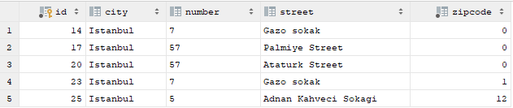
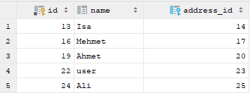
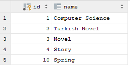
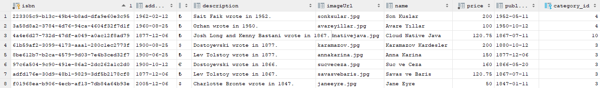
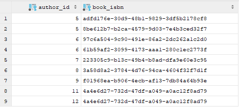
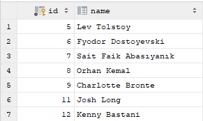
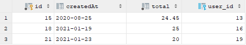
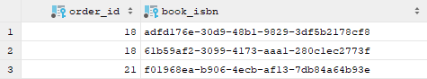

##Spring Data JPA kullanarak veritabanı işlemleri

​	Bu haftaki ödevde verilen tabanı tasarımını tasarımına uygun entityler yaratılıp aralarındaki işlemler de sağlandıktan sonra kitap, yazar, sipariş ve kullanıcı kayıtları kullanılarak işlemler yapıldı. Bunun yanında da Spring Framework ve Apache Tomcat kullanılarak uygulama ayağa kaldırıldı ve istekler yapılarak kayıtlar oluşturulmaya ve bir dizi işlem yapılmaya çalışıldı.

​	Book ve Author entity leri arasında ManyToMany bir işiki vardır. İlişki sahibi author olarak baz alınmıştır ve author class içinde Join table işlemi yapılmıştır.(Bir kitapın bir den fazla yazarı olabilir.Bir yazarın birden fazla kitabı olabilir.Cascade islemleri All olarak verilmiştir. Ikisinde de CascadeType.ALL olmaz ise hata alabiliriz.)

​	Orders ve Book entity leri arasında da ManyToMany bir ilişki var.İlişki sahibi orders olarak ele alınmıştır ve orders class içinde Join table işlemi yapılmıştır.Eğer listede kitap olmaz ise siparişin bir anlamı yok. O yüzden CascadeType.ALL book entity sinde kullanılmıştır.

​	Diğer konfigurasyonlar önceden oluşturulduğu için onlara değinmeyeceğim. MySql veritabanı ile uygulama üzerinde yapılan işlemler sonucunda oluşturulan tablolar incelenecektir.

* Aşağıdaki tablo address tablosudur user kayıtları oluştuğunda bu tabloda userdan alınan bilgiler doğrultusunda ve aralarındaki OneToOne ilişkisi ve fetch işlemleri ile doldurulmuştur.



* Bu tabloda uygulamada oluşturulan kullanıcıları göstermektedir.5 adet kullanıcı kaydı oluşturulmuştur.Bunların doğrultusunda address bilgilerinin oluştuğuda görülmektedir.

  

* Bu tablo ise kategori tablosunu göstermektedir. Yani kategoriler görülmektedir. Kitapların kategori bilgisi burda olan kategoriler ile doldurulacaktır. Uygulama da 5 adet kategori vardır.

  

* Şimdi ise oluşturulan kitap kayıtları tablosuna bakacağız. Bu tabloda bir kitabın birden fazla yazarı olabileceğini ya da bir yazarın birden fazla kitabı olabileceğini göreceğiz. Bu tabloda kitap ismi yayın tarihi fiyatı ve kategorisi gibi bilgiler tutulmaktadır. Yazar bilgisi ise ayrı bir tabloda tutulmaktadır.

  

* ManyToMany iliki sonucunda bir author_book tablosu oluşmuştu ve bu tablo da author id ve book id leri yer almaktadır. Bu tabloya bakınca author_id si aynı olan kayıtlardan 2 şer adet var bu bir yazarın birden fazla kitabı olduğunu göstermektedir.Tabloda book_isbn numarasının da 2 defa geçtigini görüyoruz bu da bi kitabın birden fazla yazarı olabileceğini bize göstermektedir.

  

* Auhor tablosunda ise author id ve author ismi tutulmaktadır.

  

* Orders tablosunda ise siparişi verecek kullanıcı ve siparişin oluşturulma tarihi yer almaktadır. User_id ile sipariş verenlerin bilgilerine de rahatlıkla ulaşabiliriz.

  

* Orders_book tablosu ise Join Table bir tabloydu hem orders_id hem de book_isbn bilgileri tutulmakta idi. Böylece kullanıcı siparişleri tutuluyordu.Bu tabloda order_id si 18 olan 2 kayıt görüyoruz ve bu siparişde 2 adet farklı kitap siparişi yapılmıştır. Yani bir kullanıcı 2 adet kitap sipariş etmiştir.

  


Bunlar haricinde kitap ismine göre arama yaparsak da o kitap hakkında kitap ın yazar bilgisine kategori bilgisine ve kitap bilgilerin ulaşabiliriz. Önrek olarak da Charlotte Bronte nin Jane Eyre adlı kitabını aradığımızda aşağıdaki gibi bir sonuç gelecektir.

```
Jane Eyre
[Author{id=9, name='Charlotte Bronte', registeredAuthorBook=[Book{isbn='f01968ea-b906-4ecb-af13-7db84a64b93e', name='Jane Eyre', description='Charlotte Bronte wrote in 1847.', publishedDate=1847-01-11, addedDate=2005-12-06, price=50.0, currency='$', imageUrl='janeeyre.jpg',
category=Category{id=3, name='Novel'}}]}]
```

Yazar ismine göre arama yaparsak da Fyodor Dostoyevski nin kitap kayıtlarına ulaşmak istediğimde ise şu sonuç alınacaktır.

```
Author{id=6, name='Fyodor Dostoyevski', registeredAuthorBook=[Book{isbn='6fcac818-110e-40d3-b34f-8c14550e4761', name='Suc ve Ceza', description='Dostoyevski wrote in 1866.', publishedDate=1866-05-20, addedDate=1900-10-12, price=160.0, currency='€', imageUrl='sucveceza.jpg',
category=Category{id=3, name='Novel'}}, Book{isbn='99e06073-3c39-43ff-97bc-a4d332c9df15', name='Karamazov Kardesler', description='Dostoyevski wrote in 1877.', publishedDate=1880-10-12, addedDate=1900-08-25, price=200.0, currency='$', imageUrl='karamazov.jpg',
category=Category{id=3, name='Novel'}}]}
```

Mehmet adlı kullanıcının kitap siparişlerine ve kişisel bilgilerine de Mehmet ismi ile arama yaptuğımızda ulaşabiliyoruz.

```
Orders{id = 22, createdAt = 2021-01-19,
user = User{id=20, name='Mehmet', address=Address{id=21, street='Palmiye Street', number='57', city='Istanbul', zipcode=0}},
registeredOrderBook = [Book{isbn='2897cc43-7690-4fc7-a53b-11d7090038bd', name='Savas ve Baris', description='Lev Tolstoy wrote in 1867.', publishedDate=1867-07-11, addedDate=1877-12-06, price=120.75, currency='?', imageUrl='savasvebaris.jpg',
category=Category{id=3, name='Novel'}}, Book{isbn='99e06073-3c39-43ff-97bc-a4d332c9df15', name='Karamazov Kardesler', description='Dostoyevski wrote in 1877.', publishedDate=1880-10-12, addedDate=1900-08-25, price=200.0, currency='$', imageUrl='karamazov.jpg',
category=Category{id=3, name='Novel'}}], total=25.0}
```

Tum yazar kayıtlarına ulaşabiliriz.

```
All writers are getting....
Author{id=5, name='Lev Tolstoy', registeredAuthorBook=[Book{isbn='2897cc43-7690-4fc7-a53b-11d7090038bd', name='Savas ve Baris', description='Lev Tolstoy wrote in 1867.', publishedDate=1867-07-11, addedDate=1877-12-06, price=120.75, currency='?', imageUrl='savasvebaris.jpg',
category=Category{id=3, name='Novel'}}, Book{isbn='c22915b2-b7e2-4fd3-8950-ec038691e9eb', name='Anna Karina', description='Lev Tolstoy wrote in 1877.', publishedDate=1877-12-06, addedDate=1900-06-25, price=150.0, currency='?', imageUrl='annakarina.jpg',
category=Category{id=3, name='Novel'}}]}
Author{id=6, name='Fyodor Dostoyevski', registeredAuthorBook=[Book{isbn='6fcac818-110e-40d3-b34f-8c14550e4761', name='Suc ve Ceza', description='Dostoyevski wrote in 1866.', publishedDate=1866-05-20, addedDate=1900-10-12, price=160.0, currency='€', imageUrl='sucveceza.jpg',
category=Category{id=3, name='Novel'}}, Book{isbn='99e06073-3c39-43ff-97bc-a4d332c9df15', name='Karamazov Kardesler', description='Dostoyevski wrote in 1877.', publishedDate=1880-10-12, addedDate=1900-08-25, price=200.0, currency='$', imageUrl='karamazov.jpg',
category=Category{id=3, name='Novel'}}]}
Author{id=7, name='Sait Faik Abasıyanık', registeredAuthorBook=[Book{isbn='47a98e60-2868-48d0-ad08-6530bfedc978', name='Son Kuslar', description='Sait Faik wrote in 1952.', publishedDate=1952-05-11, addedDate=1962-02-12, price=200.0, currency='?', imageUrl='sonksular.jpg',
category=Category{id=4, name='Story'}}]}
Author{id=8, name='Orhan Kemal', registeredAuthorBook=[Book{isbn='9140f236-ea2d-42e3-8d45-890294706521', name='Avare Yıllar', description='Orhan wrote in 1950.', publishedDate=1950-10-12, addedDate=1960-08-25, price=100.0, currency='?', imageUrl='avareyillar.jpg',
category=Category{id=4, name='Story'}}]}
Author{id=9, name='Charlotte Bronte', registeredAuthorBook=[Book{isbn='4e60dd87-49d1-4d59-9ad2-cd8ab62c3ee7', name='Jane Eyre', description='Charlotte Bronte wrote in 1847.', publishedDate=1847-01-11, addedDate=2005-12-06, price=50.0, currency='$', imageUrl='janeeyre.jpg',
category=Category{id=3, name='Novel'}}]}
Author{id=11, name='Josh Long', registeredAuthorBook=[Book{isbn='43db5451-9f0a-4d0a-b7bc-0f74688b818c', name='Cloud Native Java', description='Josh Long and Kenny Bastani wrote in 1867.', publishedDate=1867-07-11, addedDate=1877-12-06, price=120.75, currency='?', imageUrl='cloudnativejava.jpg',
category=Category{id=10, name='Spring'}}]}
Author{id=12, name='Kenny Bastani', registeredAuthorBook=[Book{isbn='43db5451-9f0a-4d0a-b7bc-0f74688b818c', name='Cloud Native Java', description='Josh Long and Kenny Bastani wrote in 1867.', publishedDate=1867-07-11, addedDate=1877-12-06, price=120.75, currency='?', imageUrl='cloudnativejava.jpg',
category=Category{id=10, name='Spring'}}]}

```

Tüm verilen siparişler

```
All Orders
Orders{id = 19, createdAt = 2020-08-25,
user = User{id=17, name='Isa', address=Address{id=18, street='Gazo sokak', number='7', city='Istanbul', zipcode=0}},
registeredOrderBook = [], total=24.45}
Orders{id = 22, createdAt = 2021-01-19,
user = User{id=20, name='Mehmet', address=Address{id=21, street='Palmiye Street', number='57', city='Istanbul', zipcode=0}},
registeredOrderBook = [Book{isbn='2897cc43-7690-4fc7-a53b-11d7090038bd', name='Savas ve Baris', description='Lev Tolstoy wrote in 1867.', publishedDate=1867-07-11, addedDate=1877-12-06, price=120.75, currency='?', imageUrl='savasvebaris.jpg',
category=Category{id=3, name='Novel'}}, Book{isbn='99e06073-3c39-43ff-97bc-a4d332c9df15', name='Karamazov Kardesler', description='Dostoyevski wrote in 1877.', publishedDate=1880-10-12, addedDate=1900-08-25, price=200.0, currency='$', imageUrl='karamazov.jpg',
category=Category{id=3, name='Novel'}}], total=25.0}
Orders{id = 25, createdAt = 2021-01-23,
user = User{id=23, name='Ahmet', address=Address{id=24, street='Ataturk Street', number='57', city='Istanbul', zipcode=0}},
registeredOrderBook = [Book{isbn='4e60dd87-49d1-4d59-9ad2-cd8ab62c3ee7', name='Jane Eyre', description='Charlotte Bronte wrote in 1847.', publishedDate=1847-01-11, addedDate=2005-12-06, price=50.0, currency='$', imageUrl='janeeyre.jpg',
category=Category{id=3, name='Novel'}}], total=20.0}
```

Tüm kitap kayıtlarına ulaşabiliyoruz.

```
Book{isbn='2897cc43-7690-4fc7-a53b-11d7090038bd', name='Savas ve Baris', description='Lev Tolstoy wrote in 1867.', publishedDate=1867-07-11, addedDate=1877-12-06, price=120.75, currency='?', imageUrl='savasvebaris.jpg',
category=Category{id=3, name='Novel'}}
Book{isbn='43db5451-9f0a-4d0a-b7bc-0f74688b818c', name='Cloud Native Java', description='Josh Long and Kenny Bastani wrote in 1867.', publishedDate=1867-07-11, addedDate=1877-12-06, price=120.75, currency='?', imageUrl='cloudnativejava.jpg',
category=Category{id=10, name='Spring'}}
Book{isbn='47a98e60-2868-48d0-ad08-6530bfedc978', name='Son Kuslar', description='Sait Faik wrote in 1952.', publishedDate=1952-05-11, addedDate=1962-02-12, price=200.0, currency='?', imageUrl='sonksular.jpg',
category=Category{id=4, name='Story'}}
Book{isbn='4e60dd87-49d1-4d59-9ad2-cd8ab62c3ee7', name='Jane Eyre', description='Charlotte Bronte wrote in 1847.', publishedDate=1847-01-11, addedDate=2005-12-06, price=50.0, currency='$', imageUrl='janeeyre.jpg',
category=Category{id=3, name='Novel'}}
Book{isbn='6fcac818-110e-40d3-b34f-8c14550e4761', name='Suc ve Ceza', description='Dostoyevski wrote in 1866.', publishedDate=1866-05-20, addedDate=1900-10-12, price=160.0, currency='€', imageUrl='sucveceza.jpg',
category=Category{id=3, name='Novel'}}
Book{isbn='9140f236-ea2d-42e3-8d45-890294706521', name='Avare Yıllar', description='Orhan wrote in 1950.', publishedDate=1950-10-12, addedDate=1960-08-25, price=100.0, currency='?', imageUrl='avareyillar.jpg',
category=Category{id=4, name='Story'}}
Book{isbn='99e06073-3c39-43ff-97bc-a4d332c9df15', name='Karamazov Kardesler', description='Dostoyevski wrote in 1877.', publishedDate=1880-10-12, addedDate=1900-08-25, price=200.0, currency='$', imageUrl='karamazov.jpg',
category=Category{id=3, name='Novel'}}
Book{isbn='c22915b2-b7e2-4fd3-8950-ec038691e9eb', name='Anna Karina', description='Lev Tolstoy wrote in 1877.', publishedDate=1877-12-06, addedDate=1900-06-25, price=150.0, currency='?', imageUrl='annakarina.jpg',
category=Category{id=3, name='Novel'}}

```

 Tüm var olan kategorilere ulaşabiliriz

```
All categories are getting.
Category{id=1, name='Computer Science'}
Category{id=2, name='Turkish Novel'}
Category{id=3, name='Novel'}
Category{id=4, name='Story'}
Category{id=10, name='Spring'}

```

Tüm var olan kullanıcı bilgilerine ulaşabiliriz.

```
User{id=13, name='user', address=Address{id=14, street='Gazo sokak', number='7', city='Istanbul', zipcode=1}}
User{id=15, name='Ali', address=Address{id=16, street='Adnan Kahveci Sokagi', number='5', city='Istanbul', zipcode=12}}
User{id=17, name='Isa', address=Address{id=18, street='Gazo sokak', number='7', city='Istanbul', zipcode=0}}
User{id=20, name='Mehmet', address=Address{id=21, street='Palmiye Street', number='57', city='Istanbul', zipcode=0}}
User{id=23, name='Ahmet', address=Address{id=24, street='Ataturk Street', number='57', city='Istanbul', zipcode=0}}
```

Yukarıdaki verilen doğrultusunda ve anlatılanlar doğrultusunda ödev yapılmaya çalışılmıştır.